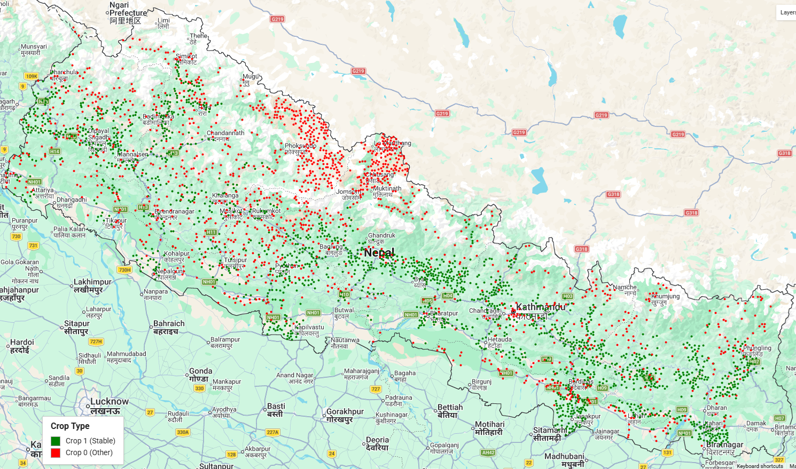
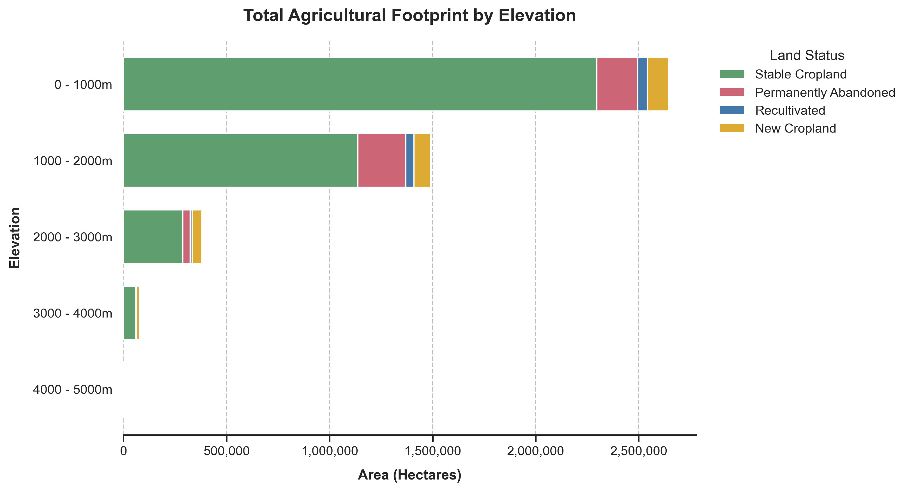
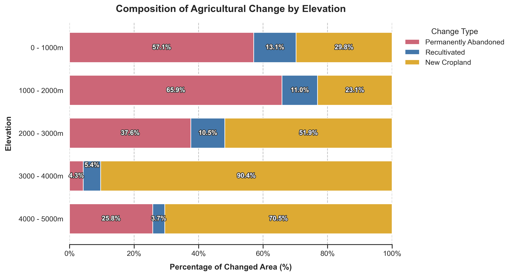
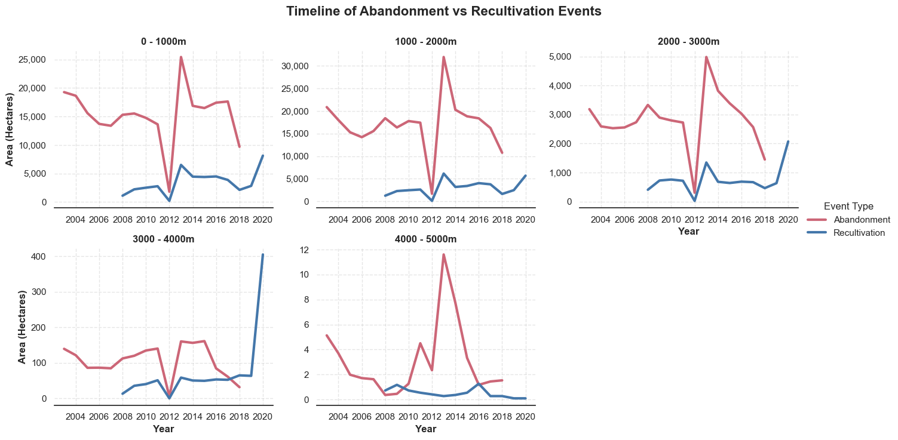
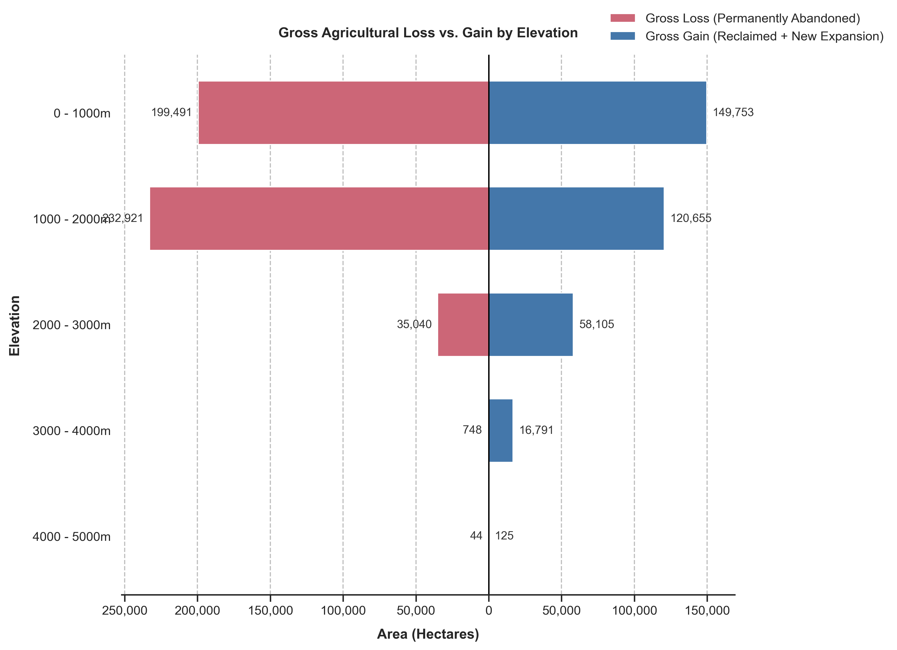
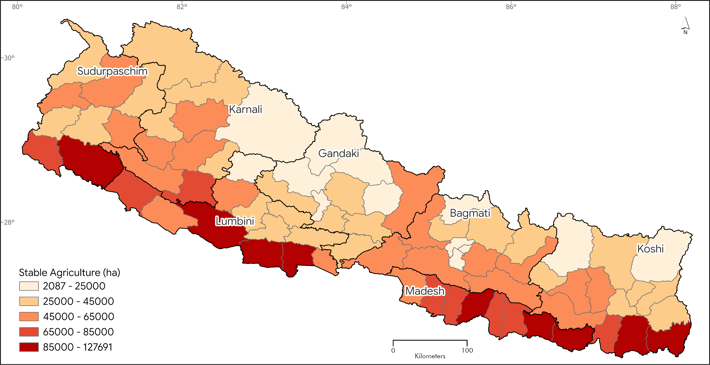
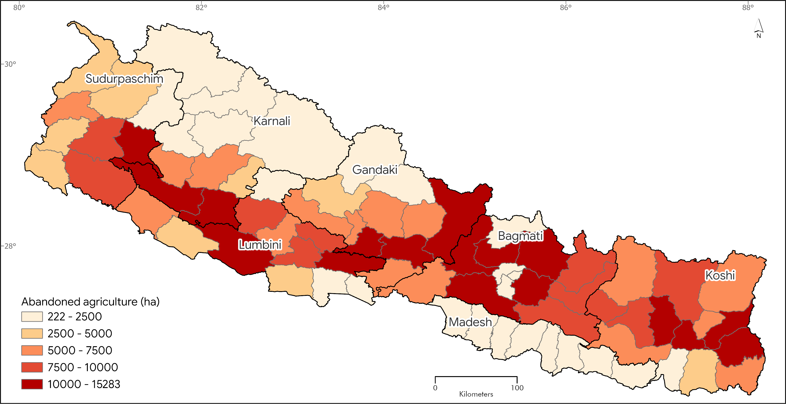
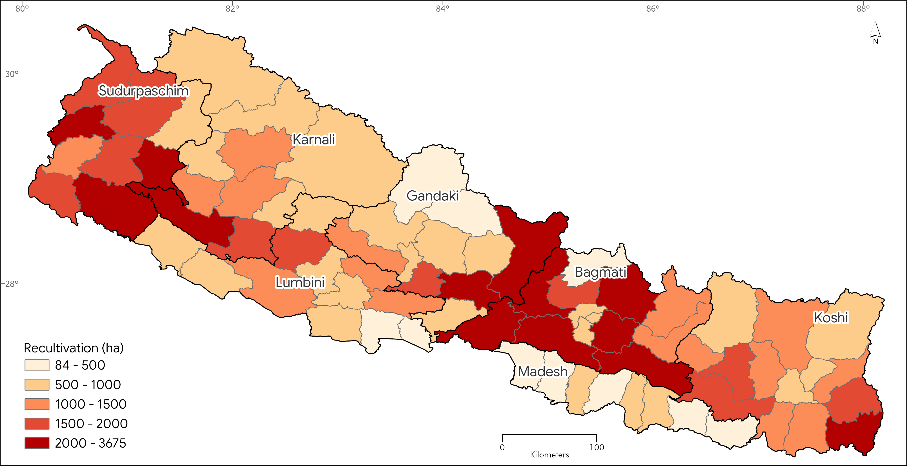
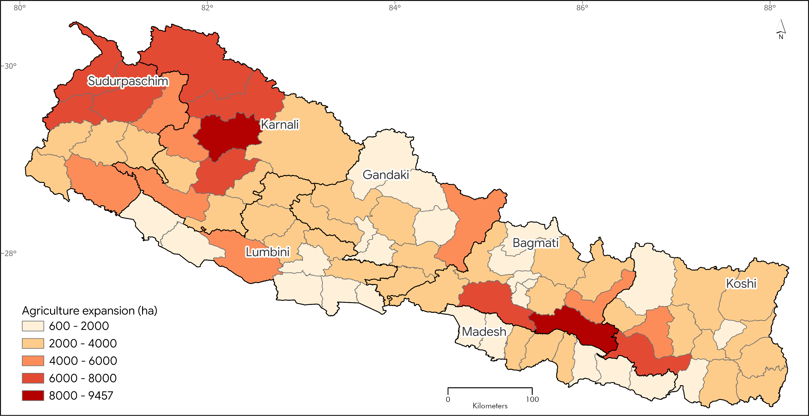

---
format:
  revealjs:
    theme: dark
    transition: slide
    slide-number: "c/t"
    progress: true
    controls: true
    controls-layout: edges
    scrollable: true
    incremental: false
    footer: "<a href='index.html'>🏠 Home</a> | <a href='project_progress2.html'>📊 Project Progress</a>"
---

## Datasets

::: {layout-ncol=2}
{.lightbox}

{.lightbox}
:::

## Random Forest Cropland Probability Prediction Results

### 2000

::: {layout-ncol=5}
{.lightbox}

{.lightbox}

{.lightbox}

{.lightbox}

{.lightbox}
:::

### 2001

::: {layout-ncol=5}
{.lightbox}

{.lightbox}

{.lightbox}

{.lightbox}

{.lightbox}
:::

### 2002

::: {layout-ncol=5}
{.lightbox}

{.lightbox}

{.lightbox}

{.lightbox}

{.lightbox}
:::

### 2003

::: {layout-ncol=5}
{.lightbox}

{.lightbox}

{.lightbox}

{.lightbox}

{.lightbox}
:::

### 2004

::: {layout-ncol=5}
{.lightbox}

{.lightbox}

{.lightbox}

{.lightbox}

{.lightbox}
:::

### 2005

::: {layout-ncol=5}
{.lightbox}

{.lightbox}

{.lightbox}

{.lightbox}

{.lightbox}
:::

### 2006

::: {layout-ncol=5}
{.lightbox}

{.lightbox}

{.lightbox}

{.lightbox}

{.lightbox}
:::

### 2007

::: {layout-ncol=5}
{.lightbox}

{.lightbox}

{.lightbox}

{.lightbox}

{.lightbox}
:::

### 2008

::: {layout-ncol=5}
{.lightbox}

{.lightbox}

{.lightbox}

{.lightbox}

{.lightbox}
:::

### 2009

::: {layout-ncol=5}
{.lightbox}

{.lightbox}

{.lightbox}

{.lightbox}

{.lightbox}
:::

### 2010

::: {layout-ncol=5}
{.lightbox}

{.lightbox}

{.lightbox}

{.lightbox}

{.lightbox}
:::

### 2011

::: {layout-ncol=5}
{.lightbox}

{.lightbox}

{.lightbox}

{.lightbox}

{.lightbox}
:::

### 2012

::: {layout-ncol=5}
{.lightbox}

{.lightbox}

{.lightbox}

{.lightbox}

{.lightbox}
:::

### 2013

::: {layout-ncol=5}
{.lightbox}

{.lightbox}

{.lightbox}

{.lightbox}

{.lightbox}
:::

### 2014

::: {layout-ncol=5}
{.lightbox}

{.lightbox}

{.lightbox}

{.lightbox}

{.lightbox}
:::

### 2015

::: {layout-ncol=5}
{.lightbox}

{.lightbox}

{.lightbox}

{.lightbox}

{.lightbox}
:::

### 2016

::: {layout-ncol=5}
{.lightbox}

{.lightbox}

{.lightbox}

{.lightbox}

{.lightbox}
:::

### 2017

::: {layout-ncol=5}
{.lightbox}

{.lightbox}

{.lightbox}

{.lightbox}

{.lightbox}
:::

### 2018

::: {layout-ncol=5}
{.lightbox}

{.lightbox}

{.lightbox}

{.lightbox}

{.lightbox}
:::

### 2019

::: {layout-ncol=5}
{.lightbox}

{.lightbox}

{.lightbox}

{.lightbox}

{.lightbox}
:::

### 2020

::: {layout-ncol=5}
{.lightbox}

{.lightbox}

{.lightbox}

{.lightbox}

{.lightbox}
:::

### 2021

::: {layout-ncol=5}
{.lightbox}

{.lightbox}

{.lightbox}

{.lightbox}

{.lightbox}
:::

### 2022

::: {layout-ncol=5}
{.lightbox}

{.lightbox}

{.lightbox}

{.lightbox}

{.lightbox}
:::

## Land Cover (FRTC) Trajectory Approach Results

::: {layout-ncol=2}
{.lightbox}

{.lightbox}

{.lightbox}

{.lightbox}

{.lightbox}

{.lightbox}

{.lightbox}

{.lightbox}
:::
